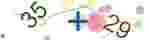

# node-behavioral-captcha [](https://www.npmjs.com/package/behavioral-captcha) [](LICENSE)

This is a simple behavioral captcha for node.js. (Based on [@napi-rs/canvas](https://github.com/Brooooooklyn/canvas))

## Screenshots

## Selection Captcha


## Calculation Captcha



## Installation

```bash
npm install behavioral-captcha
```

## Usage

```typescript
import { createSelectionCaptchaGenerator } from 'behavioral-captcha'

/*
const config = {
  size: { width: 300, height: 240 },
  thumbSize: { width: 150, height: 40 },
  textColors: ['#000', '#333', '#666', '#999', '#ccc', '#fff'],
  thumbTextColors: ['#000', '#333', '#666', '#999', '#ccc', '#fff'],
  fontSize: [30, 38],
  thumbFontSize: [24, 30],
  length: [5, 7],
  checkLength: [2, 4],
  thumbBackgroundColor: '#fff',
  chars: defaultcChars,
  fonts: ['Arial', { path: 'SomeFont.ttf', name: 'SomeFont' }],
  backgroundImages: ['image1.jpg', 'image2.jpg'],
  angles: [[0, 15]],
  quality: 80
}
*/
const generator = await createSelectionCaptchaGenerator()

const captcha = await generator.generate()
/*
{
  image: Buffer,
  thumb: Buffer,
  dots: Array<{ x: number, y: number }>,
}
*/

console.log(captcha)

console.log(await generator.verify([[13, 67], [78, 143]], captcha.dots)) // true
```

## Author

Shirasawa

## License

[MIT](LICENSE)
